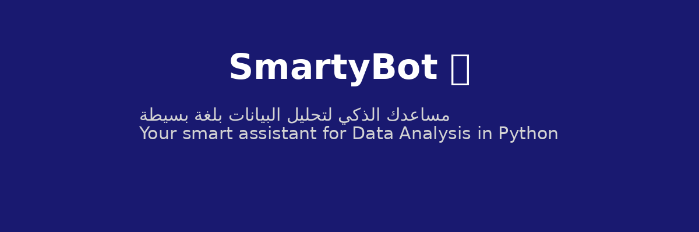

# 🤖 SmartyBot - مساعد تحليل البيانات الذكي



## 🇸🇦 نبذة عن المشروع (بالعربية)

**SmartyBot** هو بوت تليجرام تعليمي ذكي يساعد المستخدمين على تعلم تحليل البيانات بلغة بايثون، ويدعم اللغتين العربية والإنجليزية.  
يعرض شروحات مبسطة للمكتبات والدوال مع أمثلة مباشرة، ويقوم بتحليل ملفات CSV تلقائيًا وتوليد تقارير PDF مدعومة بمخططات بيانية.

### ✨ المميزات
- دعم عربي وإنجليزي تلقائي
- الرد على الأسئلة البرمجية الشائعة
- شرح مكتبات مثل: pandas, numpy, matplotlib, seaborn
- عرض أمثلة بالكود وزر تفاعلي لعرض التفاصيل
- تحليل ملفات CSV تلقائيًا وتوليد تقرير PDF
- تصميم منظم وقابل للتوسيع

---

## 🇬🇧 About the Project (English)

**SmartyBot** is a smart Telegram bot designed to help users learn Data Analysis with Python in both Arabic and English.  
It explains libraries and functions with simple language and examples, and can analyze CSV files and generate clean PDF reports with charts.

### ✨ Features
- Auto language detection (Arabic / English)
- Answers common data analysis questions
- Supports libraries: pandas, numpy, matplotlib, seaborn
- Interactive example buttons
- Automatic CSV analysis + chart + PDF report
- Clean modular structure and easy to extend

---

## 🚀 Run Locally

```bash
git clone https://github.com/your-username/smartybot.git
cd smartybot
pip install -r requirements.txt
